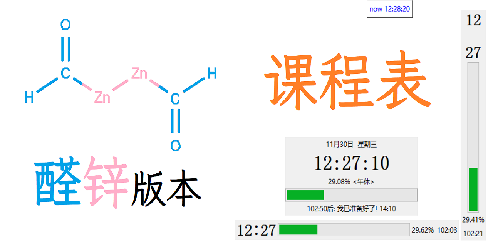

# 新课程表

醛锌版本的课程表！

[旧版链接](https://github.com/PiYuanZhouLv/ClassShedule)

# 新版“锌”在哪里？

旧版功能比较专一（只能当课程表使用），
无法配合我们班“鸡哥”（电教员）的口味，
故开发此新版。

新版包含：

* 整活功能（你干嘛，哎哟~）
* 快捷网址
* 简化UI和极简UI
* 指令功能（目前只能通过编程硬编码解决）

(TODO: the rest of the file - intro, usage, install, develop...)